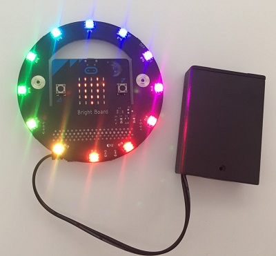

# Bright Board display

[Bright Board](https://brightwearables.com/product/bright-board/) is an accessory PCB for micro:bit that is designed for use in wearable projects. It is a part of the [Bright Wearables](https://www.brightwearables.com) product line of micro:bit-powered LED bags and backpacks. The Bright Board contains twelve SK9822/APA102 addressable LEDs which display different colors, patterns, and animations when controlled by the micro:bit.



This extension intentionally does *not* support WS2812B addressable LEDs because [the timing required to communicate with the WS2812B LEDs is not compatible with micro:bit Bluetooth functionality](https://support.microbit.org/support/solutions/articles/19000068302-why-can-t-i-use-the-bluetooth-and-neopixel-packages-at-the-same-time-). Because the Bright Board uses SK9822/APA102 LEDs, the Bright Board extension is compatible with the MakeCode micro:bit Bluetooth extension.

Project and code ideas for the Bright Board may be found at https://www.brightwearables.com/learn. The Bright Board and compatible accessory bags may be purchased at https://brightwearables.com/shop.


## Basic usage

The Bright Board MakeCode extension contains code blocks to set and manipulate the colors displayed on the twelve Bright Board LEDs. Bright Board code blocks that contain the word "show" or "fade to" will write their pattern to the LEDs when executed. If a code block doesn't contain the word "show", then it only makes changes to the buffered LED values. To make those values visible in the LEDs, you must use the "show" block.
```blocks
    brightDisplay.show()
```
## Display property blocks

Set the overall properties of the Bright Board LED display with the following code blocks:

Set the display brightness (from 0-255). The default value is 255. Brightness scaling applies only to future displays after this function call.
```blocks
brightboard.setBrightness(128)
```
Set the color order mode of the display. Defaults to RGB.
```blocks
brightboard.colorOrder(ColorOrderMode.MODE_RGB)
```
Set whether gamma correction is applied to the LEDs each time the "show" function is called. Default value is true (gamma correction on).
```blocks
brightboard.setGammaCorrect(true)
```

## Action blocks

Turns all LEDs off. Must call "show" function to execute.
```blocks
brightboard.doClear()
```
Sets all LEDs to the specified color.
```blocks
brightboard.setBoardColor(0xff0000)
```
Sets the pixel at the specified index to the specified color.
```blocks
brightboard.setPixelColor(0, 0xff0000)
```
Shifts the position of each pixel color around the ring by the specified distance (with wrapping).
```blocks
brightboard.rotate(1)
```
Moves the position of each pixel color around the ring by the specified distance (no wrapping).
```blocks
brightboard.shift(1)
```
Fades the brightness of all pixel colors by a value specified from 0 to 255
```blocks
brightboard.fadeAll(128)
```

## Color blocks

Specify a color in RGB format

```blocks
brightboard.rgbColor(0, 0, 0)
```

Specify a color in HSL format
```blocks
brightboard.hsl2rgb(0, 99, 50)
```

Generate a random color (hue is randomized)
```blocks
brightboard.randomColor()
```

Return the color value of the specified pixel
```blocks
brightboard.getPixelValue(0)
```

Return the current display brightness setting
```blocks
brightboard.brightness()
```

## Pattern blocks

Set the LED colors from the specified pattern. If the pattern length is less than 12, the colors in the pattern will repeat until all LEDs are set.
```blocks
brightboard.setPattern()
```

A variable-length list of LED colors used to specify a pattern
```blocks
brightboard.colorForLedVariableLength(0x0087ff, 0x000000)
```

A list of twelve colors to set the bright board pixels with
```blocks
brightboard.colorForLed(0xff0000, 0xFF7F00, 0xFFFE00, 0x7FFF00, 0x00FF00, 0x00FF7F, 0x00FFFE, 0x007FFF, 0x0000FF, 0x7F00FF, 0xFE00FF, 0xFF007F)
```

Change the bright board display from the current colors to the specified pattern at a specified rate
```blocks
fadeToPattern(brightboard.colorForLedVariableLength(0xff0000, 0x000000), 5)
```

Create a color gradient with a specified start pixel, length, start color and end color
```blocks
brightboard.colorGradient(0,12,0xff0000,0x00ff00)
```

## Example

For instructions and examples of code utilizing the Bright Board MakeCode extension, see https://brightwearables.com/learn/

## Supported targets

* for PXT/microbit

## License

MIT

